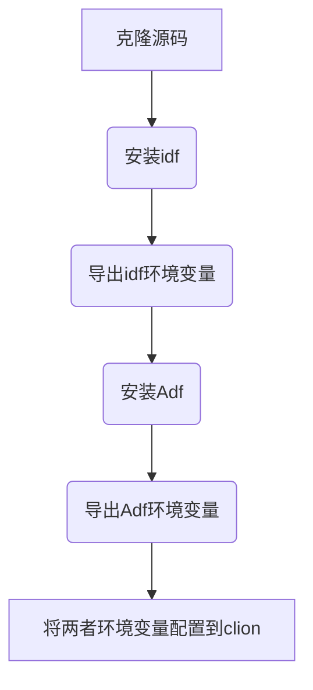

# ADF

ADF 暂未集成新建项目功能，但可以使用任务树，配置UI和调试等。

可以参考ADF的向导从[步骤1](https://docs.espressif.com/projects/esp-adf/zh_CN/latest/get-started/index.html#step-1-set-up-esp-idf)
开始

本篇采用的adf 在递归clone内置的idf， 以避免 adf和 idf版本不兼容。
>更新代码后也应当重复执行安装和导出环境变量相关操作。

主要操作如下:



## 前置条件

已经设置好idf环境需要的组件，如果安装过idf，那么必备的python git已经存在于系统，至于不同系统也有一些相关组件需要安装。可以参考前面新建项目部分的准备。

比如windows下至少需要git，然后python3可以在PATH变量中找到其路径，但不建议使用最新版本python3。可以根据安装时比如ubuntu主流python3版本抉择。


## 1.clone adf源码

因为idf是不兼容有空格路径，请在一个无空格路径下 操作。

```shell
git clone --recursive https://github.com/espressif/esp-adf.git
```

#### 无法克隆时使用代理

需要替换代理服务器地址为实际代理程序真实监听地址
<tabs>
    <tab title="Windows">
        <code-block lang="bash">
:: 设置 HTTP 代理
set http_proxy=http://127.0.0.1:7890
:: 设置 HTTPS 代理
set https_proxy=http://127.0.0.1:7890
git clone --recursive https://github.com/espressif/esp-adf.git
</code-block>
    </tab>
    <tab title="Linux">
        <code-block lang="bash">
# linux可以使用局域网其他主机提供代理服务
# 设置 HTTP 代理
export http_proxy=http://192.168.137.1:7890
# 设置 HTTPS 代理
export https_proxy=http://192.168.137.1:7890
git clone --recursive https://github.com/espressif/esp-idf.git
          </code-block>
    </tab>
    <tab title="MacOS">
        <code-block lang="bash">
export http_proxy=http://127.0.0.1:7890
export https_proxy=http://127.0.0.1:7890
git clone --recursive https://github.com/espressif/esp-idf.git
          </code-block>
    </tab>
</tabs>

## 2.安装

这里采用了windows和ubuntu24验证

### 2.1 为ADF安装IDF

进入 esp-adf目录下的 esp-idf目录

* 运行命令行终端 执行

<tabs>
    <tab title="Windows">
        <code-block lang="bash">
install.bat
</code-block>
    </tab>
    <tab title="Linux/Macos">
        <code-block lang="bash">
./install.sh
          </code-block>
    </tab>
</tabs>

* 或者使用乐鑫中国下载站

<tabs>
    <tab title="Windows">
        <code-block lang="bash">
set IDF_GITHUB_ASSETS="dl.espressif.cn/github_assets"
install.bat
</code-block>
    </tab>
    <tab title="Linux/Macos">
        <code-block lang="bash">
export IDF_GITHUB_ASSETS="dl.espressif.cn/github_assets"
./install.sh
          </code-block>
    </tab>
</tabs>

* 继续执行 `export.bat/export.sh`

执行完毕 保留cmd窗口。此时当前命令行会话的已经含有IDF的环境变量。

### 2.2 安装ADF

* 是在上一步操作中的cmd窗口 退回到 esp-adf目录或者说是 clone 下来ADF的根目录。
  `cd ..`
*  安装ADF
运行命令行终端 执行

<tabs>
    <tab title="Windows">
        <code-block lang="bash">
install.bat
</code-block>
    </tab>
    <tab title="Linux/Macos">
        <code-block lang="bash">
./install.sh
          </code-block>
    </tab>
</tabs>
* 或者使用乐鑫中国下载站

<tabs>
    <tab title="Windows">
        <code-block lang="bash">
set IDF_GITHUB_ASSETS="dl.espressif.cn/github_assets"
install.bat
</code-block>
    </tab>
    <tab title="Linux/Macos">
        <code-block lang="bash">
export IDF_GITHUB_ASSETS="dl.espressif.cn/github_assets"
./install.sh
          </code-block>
    </tab>
</tabs>

* 执行 `export.bat/export.sh`导出ADF的环境变量。
<tabs>
    <tab title="Windows">
        <code-block lang="bash">
export.bat
</code-block>
    </tab>
    <tab title="Linux/Macos">
        <code-block lang="bash">
./export.sh
          </code-block>
    </tab>
</tabs>

> 这一步操作完成之后，该窗口已经包含ADF和IDF的环境变量，可以使用当前命令行窗口，进入ADF相关例程目录，使用
> idf.py 执行 set-target之后 便可使用 idf.py通过`menuconfig` 配置板子类型，具体可以参考例程下的readme。
> 然后使用`idf.py flash` 烧录到具体音频开发板。

## 配置Clion Toolchain

在ADF例子中项目的根CMakeLists.txt里面一般会包含ADF和IDF所在目录的cmake文件

```CMake
include($ENV{ADF_PATH}/CMakeLists.txt)
include($ENV{IDF_PATH}/tools/cmake/project.cmake)
```

从上述内容看出这里需要两者的环境变量。一般新建一个System类型的Toolchain，同时将ADF和其目录下的idf的环境变量配置到该Toolchain才能正常cmake。

### 新建导出ADF需要的环境变量的脚本

保留之前 2.2安装的完成的命令行，此命令行已经包含了ADF和IDF所有环境变量。
>若没有保留，可以新建命令行，先进入adf下idf目录执行export脚本 导出环境变量到当前命令行会话
> 然后cd ..再执行adf目录的export脚本，从而得到一个含全部环境变量的会话。

这个时候可以自己制作一个最简单环境变量导出脚本，也就是只导出环境变量不含任何逻辑的脚本。

这一步需要仔细操作，确保得到脚本格式正确可以导出环境变量。

* windows下使用 SET 命令可以打印当前命令行所有环境变量。
  则使用 `SET >export_adf.bat` 制作一个脚本，
  **然后编辑该脚本给行首加上 `set `这样得到一个脚本**大致内容是
```shell
set ADF_PATH=D:\ESP_ADF\esp-adf
set HOMEDRIVE=C:
set HOMEPATH=\Users\immor
set IDF_CCACHE_ENABLE=1
xxxxx
```
* linux下已经验证(mac暂未尝试)
理论上使用`env >export_adf.sh`得到脚本后**给行首加上`export `便可**
类似以下内容:
```shell
export ADF_PATH=/home/xxx/esp_adf/esp-adf
export IDF_CCACHE_ENABLE=1
xxxxx
```
> 这里面可能包含上述clone代码过程，设置的http代理，可以根据需要去除，以防代理没有开的时候，连不上组件仓库。

### 配置ToolChain

新建一个System类型的Toolchain，选择上一步新建的脚本即可。


### 打开ADF项目 {id="open_adf_project"}

打开ADF项目时选择刚才新建的Toolchain 然后将cmake输出路径改成 build文件夹。

可使用命令树大部分节点，但`IDF Export Console` 不可使用。


